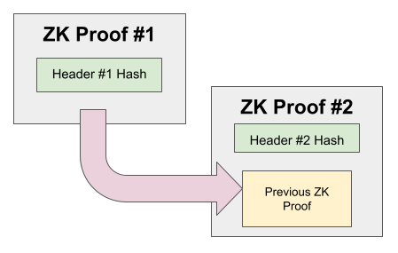
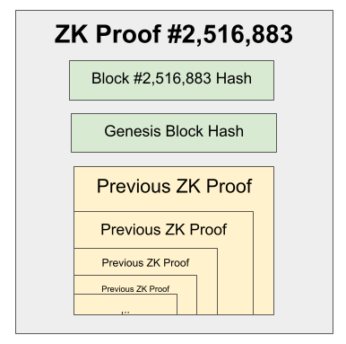

# Celestia Sync by Celestia Labs

**Summary:** Optimize blockchain node to synchronize consensus instantly, using recursive ZK proofs.

**Team Members:** [Connor] ([https://github.com/S1nus], [https://twitter.com/colludingnode])

**Repo Link:** [crs-server](https://github.com/S1nus/crs-server/)

---
## Problem

Blockchain nodes have a long and cumbersome synchronization process, preventing them from being smoothly embedded into wallets and applications. All users deserve the security of a full node- can we restore them with the help of recursive zero-knowledge proofs?
## Solution

[How did you solve your problem, what did you use SP1 for?]
We took the SP1 proof of Tendermint consensus, upgraded it recursively verify itself, and deployed a web service to follow the chain and constantly update a running instance of the proof.

## Performance Metrics
13M cycles
