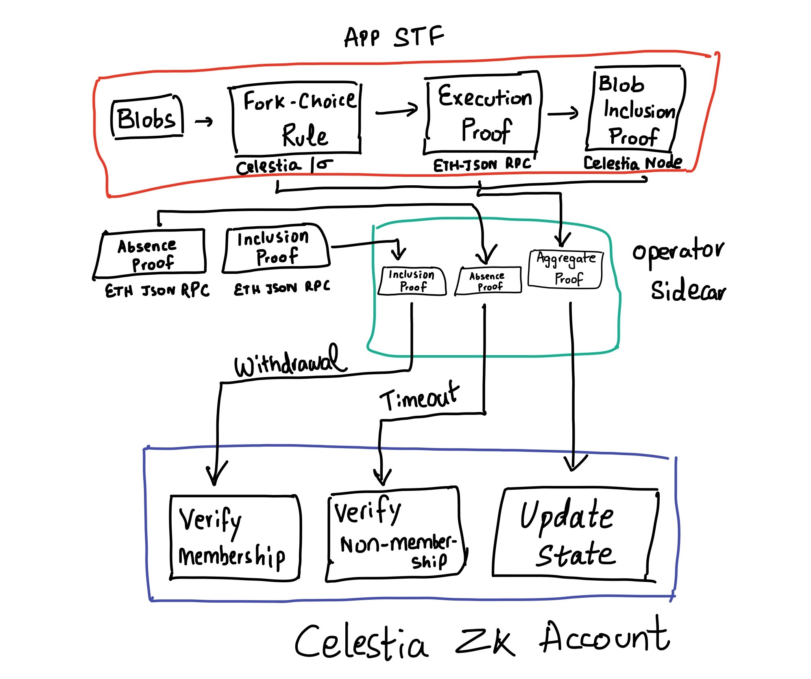

# EVM ZK IBC to Celestia by Rollkit

**Summary:** ZK IBC from EVM to Celestia’s ZK Accounts

**Team Members:** Manav (https://github.com/Manav-Aggarwal, https://x.com/0xnavage)

**Repo Link:** [https://github.com/rollkit/rollkit/issues/1860#issuecomment-2375104525, https://github.com/celestiaorg/celestia-app/tree/cal/zk-ibc-prototype/ibc/lightclients/groth16]

**Additional Resources:** [https://www.youtube.com/watch?v=HlIYAO_cjno&ab_channel=Celestia, https://forum.celestia.org/t/achieving-base-layer-functionality-escape-velocity-without-on-chain-smart-contracts-using-sovereign-zk-rollups/958/18, https://github.com/celestiaorg/celestia-app/tree/cal/zk-ibc-prototype/ibc/lightclients/groth16]

---

## Problem

Celestia does not have a VM to minimize on-chain state and can only send and receive TIA , its native asset, via IBC. This means that native rollups of Celestia cannot form a trust-minimized bridge to it. By adding a ZK verifier for rollups, Celestia plans to enable rollups to form trust-minimized bridges to it. This means each rollup becomes a Celestia ZK Account.

Rollkit is the stack for Celestia’s native ecosystem of applications which do not have an enshrined bridge. Forming a bridge to another chain currently requires relying on committee-based bridges. We want the ability to establish a trust-minimized bridge to another chain, starting with Celestia via a new IBC client that verifies a rollup’s state transition function which comprises of its fork choice rule, an optional ordering rule, an execution proof, and a blob inclusion proof.

## Solution

We've come up with a PoC to figure out all the necessary components needed to establish a trust-minimized bridge via ZK IBC from a vanilla EVM sovereign rollup built with Rollkit to Celestia's ZK Accounts. This involves the following:

- Generating a proof of the fork choice rule of the rollup chain to get the canonical list of transactions: this can just be proof of verifying a single sequencer's signature to start with or something more elaborate later on. This just requires an RPC of the rollup chain to retrieve a header from, and later an SP1 program that goes through the DA layer to prove the fork choice rule over blobs of the rollup's namespace.

- [Generating execution proofs for a range of EVM blocks](https://github.com/invocarnau/succint-zk-residency/blob/main/fep-type-1/block-aggregation/client/src/main.rs). This just requires an ETH-JSON RPC with archival mode configured for the chain.

- Generating [blob inclusion proofs](https://github.com/S1nus/sp1-blob-inclusion/blob/main/program/src/main.rs) for corresponding blobs that include transactions of the rollup. This requires access to a Celestia light node which allows retrieval of the [blob inclusion proofs](https://github.com/rollkit/go-da/blob/df792b19bab9d7064d3aeb20be6500cd9b151bc7/da.go#L23)

These three proofs need to be verified in an SP1 program to generate an aggregated proof.

This aggregated proof needs to be substituted in an [operator sidecar process](https://github.com/cosmos/sp1-ics07-tendermint/blob/9ee431733a1b4645024e348eca7f8fdd3c8e17c5/operator/src/runners/operator.rs#L80) to be run alongside the rollup chain. This operator will generate this aggregated proof periodically and then relay it to Celestia to update the rollup IBC light client on the Celestia state machine.

In order to handle withdrawals and timeouts, there also needs to be proofs for inclusion and non-inclusion for the EVM which we need a corresponding SP1 program for. We can use this [verification code](https://github.com/unionlabs/union/blob/4e987f48d90af728cda09a992b2ea51220a43f33/lib/ethereum-verifier/src/verify.rs#L303) written in rust from union for it. These proofs should also be generated by the operator sidecar process to relay them in a similar fashion to the rollup IBC light client on the Celestia state machine.

The Celestia Labs protocol team also started on a PoC for this rollup IBC client on Celestia that exists [here](https://github.com/celestiaorg/celestia-app/tree/cal/zk-ibc-prototype/ibc/lightclients/groth16). This should be able to verify the proofs generated by the operator sidecar process as described above. This PoC covers the end to end bridging from a vanilla EVM rollup to Celestia. Bridging back from Celestia to the EVM chain would just use the IBC 007 tendermint client that verifies the aggregated signature of the Celestia validator set until Celestia's state machine is ZK proven as well so this side of the bridge can be trust-minimized as well.
